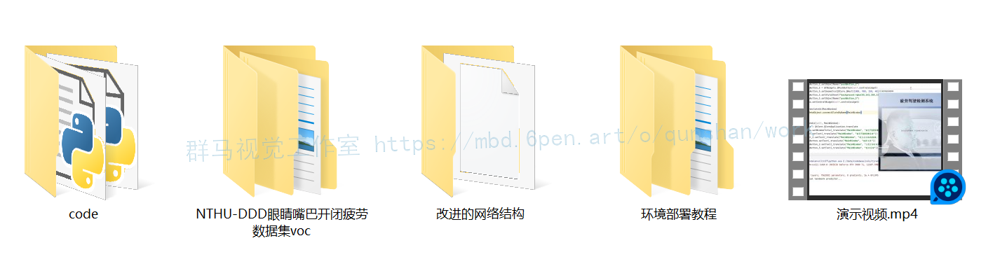

# 1.研究背景
疲劳驾驶成为了导致交通事故发生的重要因素之一,并呈现出逐年递增的趋势,若能设计出一种在驾驶员发生疲劳时,就能检测出驾驶员处于疲劳状态对其进行警告,这样就可以较好地降低交通事故的发生的概率.论文介绍了一种检测驾驶员在驾驶过程中是否为疲劳驾驶的方法,基于PERCLOS对驾驶员进行疲劳检测.首先对设备采集的人脸图像进行肤色分割,根据程序中设定的肤色阈值,确定图像中属于肤色的区域,对得到的肤色区域进行眼睛追踪,人脸特征部位进行积分投影操作,获取眼睛区域,捕捉眼睛的实时状态,并对眼睛的面积进行计算,最后根据疲劳值来判定疲劳状态.根据实验证明,该方法满足车载、实时、非接触的基本要求,并能准确地做出对驾驶员驾驶过程中是否出现疲劳的判定.

# 2.图片演示


# 3.视频演示
[基于Perclos＆改进YOLOv7的疲劳驾驶DMS检测系统（哈欠＆喝水＆抽烟＆打电话检测）_哔哩哔哩_bilibili](https://www.bilibili.com/video/BV1gK411o7Cw/?vd_source=bc9aec86d164b67a7004b996143742dc)

# 4.算法流程图


# 5.PERCLOS测试原理
[参考该博客提出的方案，PERCLOS（Percentage of Eyelid Closure Overthe Pupil Over Time）的含义是指在单位时间内眼睛闭合状态下所占用的时间百分比](https://afdian.net/item?plan_id=5b1fe3bc6af411ed820752540025c377)［4］

结合图 1 可以较为容易地理解其测量原理。根据下面的计算公式，通过测量 t1~t4 的值来计算
PERCLOS的值。

其中 f 为计算后求得的 PERCLOS 值，t1~t4 代表的[图片上传中...(image.png-f4d849-1669187187473-0)]
含义如测量原理图所示，表示时间区间内眼睛开闭程度。在具体实验中 PERCLOS 有三种度量标准，即为 P70、P80、EM，分别代表眼睛在不同闭合程度下所占用的时间百分比。其中 P80 指的是在测试过程中，检测对象的眼睛闭合面积超过80%所占用的时间百分比。大量研究表明，在三种度量标准中对疲劳驾驶的检测准确率最高的是P80［5］标准。因此本文采用此标准进行疲劳判定，计算公式如下：

用此方法追踪眼睛状态时，由摄像头对驾驶员的头部区域进行捕获，对采集过程中可能出现的过暗图像加上光照补偿，采取YCbCr对肤色进行分割来确定人脸区域，对眼部轮廓进行提取，运用图像处理来判断眼睛的开闭状态。定义检测过程中人物眼睛睁开程度只要满足大于20%这个条件，就记为睁开状态，反之为闭合。

# 6.人脸眼睛、嘴巴开闭状态、喝水抽烟打电话检测
#### YOLOv7
  YOLOv7是YOLO系列中最先进的新型目标检测器。根据论文所述，它是迄今为止最快、最准确的实时目标检测器，最好的模型获得了56.8%的平均精度(AP)，这是所有已知目标检测器中最高的，各种模型的速度范围在 5~160 FPS。

 本文主要介绍简化的YOLOv7论文解读和推理测试以及YOLOv7与 YOLO系列的其他目标检测器的比较。

 YOLOv7通过将性能提升一个档次建立了重要的基准。从YOLOv4开始在极短的时间内，我们看到YOLO家族的新成员接踵而至。每个版本都引入了一些新的东西来提高性能。早些时候，我们已经详细讨论了以前的 YOLO 版本。
   不同的应用需要不同的模型。虽然有些人需要高度准确的模型，但有些人优先考虑速度。执行模型缩放以适应这些要求并使其适合各种计算设备。
在缩放模型大小时，会考虑以下参数：
1.分辨率（输入图像的大小）
2.宽度（通道数）
3.深度（网络层数）
4.阶段（特征金字塔的数量）
NAS（Network Architecture Search）是一种常用的模型缩放方法。研究人员使用它来迭代参数以找到最佳比例因子。但是，像 NAS 这样的方法会进行参数特定的缩放。在这种情况下，比例因子是独立的。

YOLOv7论文的作者表明，它可以通过复合模型缩放方法进一步优化。在这里，对于基于连接的模型，宽度和深度是连贯地缩放的。


#### 算法改进
YOLOv7 改进特征融合网络BiFPN结构 ，[参考EfficientDet中提出的加权的双向特征金字塔网络](https://mbd.pub/o/bread/Y5yYlpZq)，它允许简单和快速的多尺度特征融合。为了追求更高效的多尺度融合方式。以往的特征融合是平等地对待不同尺度特征，CVPR 2017的FPN指出了不同层之间特征融合的重要性，并且以一种比较简单，Heuristic的方法把底层的特征乘两倍和浅层相加来融合。之后人们也试了各种别的融合方法，比如PANet先从底向上连，再自顶向下连回去（上图b）；NAS-FPN 采用神经架构搜索来搜索更好的跨尺度特征网络拓扑，但是在搜索过程中需要花费数千个GPU小时，并且发现的网络不规则，难以解释或修改，如上图 ( c )所示。总之上述都是一些人工各种连接的设计，包含Conv，Sum，Concatenate，Resize，Skip Connection等候选操作。很明显使用哪些操作、操作之间的顺序是可以用NAS搜的。


#### 代码实现
```
class Concat(nn.Module):
    # Concatenate a list of tensors along dimension
    def __init__(self, c1, c2):
        super(Concat, self).__init__()
        # self.relu = nn.ReLU()
        self.w1 = nn.Parameter(torch.ones(2, dtype=torch.float32), requires_grad=True)
        self.w2 = nn.Parameter(torch.ones(3, dtype=torch.float32), requires_grad=True)
        self.epsilon = 0.0001
        self.conv = nn.Conv2d(c1, c2, kernel_size=1, stride=1, padding=0)
        self.swish = MemoryEfficientSwish()

    def forward(self, x):
        outs = self._forward(x)
        return outs

    def _forward(self, x): # intermediate result
        if len(x) == 2:
            # w = self.relu(self.w1)
            w = self.w1
            weight = w / (torch.sum(w, dim=0) + self.epsilon)
            x = self.conv(self.swish(weight[0] * x[0] + weight[1] * x[1]))
        elif len(x) == 3: # final result
            # w = self.relu(self.w2)
            w = self.w2
            weight = w / (torch.sum(w, dim=0) + self.epsilon)
            x = self.conv(self.swish(weight[0] * x[0] + weight[1] * x[1] + weight[2] * x[2]))
```

# 7.系统整合
下图[完整源码＆环境部署视频教程＆数据集＆自定义UI界面](https://s.xiaocichang.com/s/1be984)

参考博客[《基于Perclos＆改进YOLOv7的疲劳驾驶DMS检测系统（源码＆教程）》](https://mbd.pub/o/qunma/work)


# 8.参考文献
***
[1][荔小虎](https://s.wanfangdata.com.cn/paper?q=%E4%BD%9C%E8%80%85:%22%E8%8D%94%E5%B0%8F%E8%99%8E%22),[唐晶磊](https://s.wanfangdata.com.cn/paper?q=%E4%BD%9C%E8%80%85:%22%E5%94%90%E6%99%B6%E7%A3%8A%22).[基于肤色匹配和积分投影结合的人眼定位方法研究](https://d.wanfangdata.com.cn/periodical/zdhyy201812026)[J].[自动化应用](https://sns.wanfangdata.com.cn/perio/zdhyy).2018,(12).DOI:[10.3969/j.issn.1674-778X.2018.12.026](http://dx.chinadoi.cn/10.3969/j.issn.1674-778X.2018.12.026).

[2][杨恒](https://s.wanfangdata.com.cn/paper?q=%E4%BD%9C%E8%80%85:%22%E6%9D%A8%E6%81%92%22),[张再军](https://s.wanfangdata.com.cn/paper?q=%E4%BD%9C%E8%80%85:%22%E5%BC%A0%E5%86%8D%E5%86%9B%22),[杨东](https://s.wanfangdata.com.cn/paper?q=%E4%BD%9C%E8%80%85:%22%E6%9D%A8%E4%B8%9C%22),等.[融合YCbCr肤色模型与区域标记的人脸检测算法研究](https://d.wanfangdata.com.cn/periodical/rjdk201602015)[J].[软件导刊](https://sns.wanfangdata.com.cn/perio/rjdk).2016,(2).DOI:[10.11907/rjdk.161028](http://dx.chinadoi.cn/10.11907/rjdk.161028).

[3][牛清宁](https://s.wanfangdata.com.cn/paper?q=%E4%BD%9C%E8%80%85:%22%E7%89%9B%E6%B8%85%E5%AE%81%22),[周志强](https://s.wanfangdata.com.cn/paper?q=%E4%BD%9C%E8%80%85:%22%E5%91%A8%E5%BF%97%E5%BC%BA%22),[金立生](https://s.wanfangdata.com.cn/paper?q=%E4%BD%9C%E8%80%85:%22%E9%87%91%E7%AB%8B%E7%94%9F%22),等.[基于眼动特征的疲劳驾驶检测方法](https://d.wanfangdata.com.cn/periodical/hebgcdxxb201503022)[J].[哈尔滨工程大学学报](https://sns.wanfangdata.com.cn/perio/hebgcdxxb).2015,(3).DOI:[10.3969/j.issn.1006-7043.201311044](http://dx.chinadoi.cn/10.3969/j.issn.1006-7043.201311044).

[4][何光辉](https://s.wanfangdata.com.cn/paper?q=%E4%BD%9C%E8%80%85:%22%E4%BD%95%E5%85%89%E8%BE%89%22),[张太平](https://s.wanfangdata.com.cn/paper?q=%E4%BD%9C%E8%80%85:%22%E5%BC%A0%E5%A4%AA%E5%B9%B3%22).[局部匹配的人脸识别方法](https://d.wanfangdata.com.cn/periodical/cqdxxb201212020)[J].[重庆大学学报：自然科学版](https://sns.wanfangdata.com.cn/perio/cqdxxb).2012,(12).

[5][杨超](https://s.wanfangdata.com.cn/paper?q=%E4%BD%9C%E8%80%85:%22%E6%9D%A8%E8%B6%85%22),[李博文](https://s.wanfangdata.com.cn/paper?q=%E4%BD%9C%E8%80%85:%22%E6%9D%8E%E5%8D%9A%E6%96%87%22).[基于积分投影的眼睛定位系统设计](https://d.wanfangdata.com.cn/periodical/rjdk201109057)[J].[软件导刊](https://sns.wanfangdata.com.cn/perio/rjdk).2011,(9).

[6][于兴玲](https://s.wanfangdata.com.cn/paper?q=%E4%BD%9C%E8%80%85:%22%E4%BA%8E%E5%85%B4%E7%8E%B2%22),[王民](https://s.wanfangdata.com.cn/paper?q=%E4%BD%9C%E8%80%85:%22%E7%8E%8B%E6%B0%91%22),[张立材](https://s.wanfangdata.com.cn/paper?q=%E4%BD%9C%E8%80%85:%22%E5%BC%A0%E7%AB%8B%E6%9D%90%22).[基于PERCLOS的驾驶员眼睛状态检测方法](https://d.wanfangdata.com.cn/periodical/wjsjxx200714103)[J].[微计算机信息](https://sns.wanfangdata.com.cn/perio/wjsjxx).2007,(14).DOI:[10.3969/j.issn.1008-0570.2007.14.103](http://dx.chinadoi.cn/10.3969/j.issn.1008-0570.2007.14.103).

[7][李杰](https://s.wanfangdata.com.cn/paper?q=%E4%BD%9C%E8%80%85:%22%E6%9D%8E%E6%9D%B0%22),[郝晓莉](https://s.wanfangdata.com.cn/paper?q=%E4%BD%9C%E8%80%85:%22%E9%83%9D%E6%99%93%E8%8E%89%22).[一种基于椭圆肤色模型的人脸检测方法](https://d.wanfangdata.com.cn/periodical/jsjzdclykz200602012)[J].[计算机测量与控制](https://sns.wanfangdata.com.cn/perio/jsjzdclykz).2006,(2).DOI:[10.3969/j.issn.1671-4598.2006.02.012](http://dx.chinadoi.cn/10.3969/j.issn.1671-4598.2006.02.012).

[8][李志春](https://s.wanfangdata.com.cn/paper?q=%E4%BD%9C%E8%80%85:%22%E6%9D%8E%E5%BF%97%E6%98%A5%22),[何仁](https://s.wanfangdata.com.cn/paper?q=%E4%BD%9C%E8%80%85:%22%E4%BD%95%E4%BB%81%22),[林谋有](https://s.wanfangdata.com.cn/paper?q=%E4%BD%9C%E8%80%85:%22%E6%9E%97%E8%B0%8B%E6%9C%89%22),等.[驾驶员疲劳检测技术的研究现状及发展趋势](https://d.wanfangdata.com.cn/periodical/njhyj200605068)[J].[农机化研究](https://sns.wanfangdata.com.cn/perio/njhyj).2006,(5).DOI:[10.3969/j.issn.1003-188X.2006.05.068](http://dx.chinadoi.cn/10.3969/j.issn.1003-188X.2006.05.068).

[9][冯建强](https://s.wanfangdata.com.cn/paper?q=%E4%BD%9C%E8%80%85:%22%E5%86%AF%E5%BB%BA%E5%BC%BA%22),[刘文波](https://s.wanfangdata.com.cn/paper?q=%E4%BD%9C%E8%80%85:%22%E5%88%98%E6%96%87%E6%B3%A2%22),[于盛林](https://s.wanfangdata.com.cn/paper?q=%E4%BD%9C%E8%80%85:%22%E4%BA%8E%E7%9B%9B%E6%9E%97%22).[基于灰度积分投影的人眼定位](https://d.wanfangdata.com.cn/periodical/jsjfz200504021)[J].[计算机仿真](https://sns.wanfangdata.com.cn/perio/jsjfz).2005,(4).DOI:[10.3969/j.issn.1006-9348.2005.04.021](http://dx.chinadoi.cn/10.3969/j.issn.1006-9348.2005.04.021).

[10][王文成](https://s.wanfangdata.com.cn/paper?q=%E4%BD%9C%E8%80%85:%22%E7%8E%8B%E6%96%87%E6%88%90%22),[常发亮](https://s.wanfangdata.com.cn/paper?q=%E4%BD%9C%E8%80%85:%22%E5%B8%B8%E5%8F%91%E4%BA%AE%22).[一种基于区域投影的人眼精确定位方法](https://d.wanfangdata.com.cn/periodical/gdzjg201104031)[J].[光电子·激光](https://sns.wanfangdata.com.cn/perio/gdzjg).2011,(4).


---
#### 如果您需要更详细的【源码和环境部署教程】，除了通过【系统整合】小节的链接获取之外，还可以通过邮箱以下途径获取:
#### 1.请先在GitHub上为该项目点赞（Star），编辑一封邮件，附上点赞的截图、项目的中文描述概述（About）以及您的用途需求，发送到我们的邮箱
#### sharecode@yeah.net
#### 2.我们收到邮件后会定期根据邮件的接收顺序将【完整源码和环境部署教程】发送到您的邮箱。
#### 【免责声明】本文来源于用户投稿，如果侵犯任何第三方的合法权益，可通过邮箱联系删除。